# Architecture Overview

## The Problem

You're a graduate student juggling research, coursework, and job applications. You need an assistant that can:

- **Analyze documents** — summarize papers, extract key insights from readings
- **Crunch numbers** — run statistical analyses, process datasets
- **Keep you informed** — send email alerts when deadlines approach or tasks complete

You decide a **single AI agent** can handle all of this. But here's the challenge: some tasks are simple (text processing), while others require real computation (data analysis) or external integrations (email notifications).

**How do you build this?**

## The Solution: One Agent, Multiple Tools

We'll build a **Graduate Research Assistant** — an AI agent hosted in **Azure AI Foundry** that can:

| Capability | Implementation | Why? |
|------------|----------------|------|
| Summarize text, answer questions | **In-process function** | Simple, runs inside the agent |
| Analyze data, call external APIs | **Azure Function** | Needs compute, scales independently |
| Send emails, trigger workflows | **Logic App** | Built-in connectors, no code needed |

The key insight: **the agent lives in the cloud (Azure AI Foundry), but its tools can live anywhere**. Some tools run inside the agent, others run as independent cloud services.

## Architecture Diagram

```mermaid
%%{init: {'theme': 'base', 'themeVariables': { 'primaryColor': '#0078D4', 'primaryTextColor': '#fff', 'primaryBorderColor': '#005A9E', 'lineColor': '#5C5C5C', 'secondaryColor': '#F3F2F1', 'tertiaryColor': '#E1DFDD', 'fontFamily': 'Segoe UI, sans-serif'}}}%%

flowchart TB
    subgraph HUB["<b>Azure AI Foundry Hub</b>"]
        subgraph PROJECT["<b>Azure AI Project</b>"]
            subgraph SERVICE["<b>Azure AI Agent Service</b>"]
                subgraph RUNTIME["<b>🤖 Agent Runtime</b>"]
                    direction TB
                    
                    subgraph CORE["Agent Core"]
                        direction LR
                        THREAD["💬 Thread<br/><i>Conversation state</i>"]
                        MEMORY["🧠 Memory<br/><i>Context window</i>"]
                        LLM["⚡ LLM<br/><i>GPT-4o</i>"]
                    end
                    
                    subgraph TOOLS["Tools"]
                        direction LR
                        PYTHON["🐍 <b>Python Function Tool</b><br/><i>Runs in-process</i><br/><code>summarize()</code><br/><code>extract_insights()</code>"]
                        HTTP["🌐 <b>HTTP Tools</b><br/><i>External calls</i>"]
                    end
                    
                    CORE --> TOOLS
                end
            end
        end
    end

    subgraph AZURE["<b>Azure Services</b>"]
        direction LR
        FUNC["<b>⚡ Azure Function</b><br/><code>analyze_data()</code><br/><code>process_csv()</code><br/><br/><i>Serverless compute</i>"]
        LOGIC["<b>🔄 Logic App</b><br/><code>send_email()</code><br/><code>notify_slack()</code><br/><br/><i>Workflow automation</i>"]
    end

    HTTP -->|"HTTPS"| FUNC
    HTTP -->|"HTTPS"| LOGIC

    style HUB fill:#E6F2FF,stroke:#0078D4,stroke-width:3px,color:#004578
    style PROJECT fill:#CCE4F7,stroke:#0078D4,stroke-width:2px,color:#004578
    style SERVICE fill:#B3D7F2,stroke:#0078D4,stroke-width:2px,color:#004578
    style RUNTIME fill:#0078D4,stroke:#005A9E,stroke-width:2px,color:#FFFFFF
    style CORE fill:#005A9E,stroke:#004578,stroke-width:1px,color:#FFFFFF
    style TOOLS fill:#005A9E,stroke:#004578,stroke-width:1px,color:#FFFFFF
    
    style THREAD fill:#9B59B6,stroke:#7D3C98,stroke-width:1px,color:#FFFFFF
    style MEMORY fill:#9B59B6,stroke:#7D3C98,stroke-width:1px,color:#FFFFFF
    style LLM fill:#3498DB,stroke:#2980B9,stroke-width:1px,color:#FFFFFF
    
    style PYTHON fill:#2ECC71,stroke:#27AE60,stroke-width:2px,color:#FFFFFF
    style HTTP fill:#F39C12,stroke:#D68910,stroke-width:2px,color:#FFFFFF
    
    style AZURE fill:#F5F5F5,stroke:#5C5C5C,stroke-width:2px,stroke-dasharray:5 5,color:#333
    style FUNC fill:#F39C12,stroke:#D68910,stroke-width:2px,color:#FFFFFF
    style LOGIC fill:#E74C3C,stroke:#C0392B,stroke-width:2px,color:#FFFFFF
```

### Understanding the Architecture

| Layer | What It Is | Your Responsibility |
|-------|------------|---------------------|
| **Azure AI Foundry Hub** | Top-level container for AI resources | Create once, share across projects |
| **Azure AI Project** | Workspace for a specific application | One per app (e.g., "Research Assistant") |
| **Azure AI Agent Service** | Managed service that runs agents | Microsoft manages this |
| **Agent Runtime** | Where your agent actually executes | Configure via SDK |

### Tool Types Explained

| Tool Type | Runs Where | Use Case | Example |
|-----------|------------|----------|---------|
| 🐍 **Python Function Tool** | Inside the agent runtime | Simple logic, text processing | `summarize()`, `format_output()` |
| 🌐 **HTTP Tool** → Azure Function | External serverless compute | Heavy computation, data processing | `analyze_data()`, `call_api()` |
| 🌐 **HTTP Tool** → Logic App | External workflow engine | Notifications, integrations | `send_email()`, `notify_slack()` |

> **Key insight**: Python Function Tools run *inside* the agent (fast, no network hop). HTTP Tools call *external* services (scalable, independent).

## Why This Architecture?

### Why Azure AI Foundry?

| Benefit | Description |
|---------|-------------|
| **Managed Runtime** | Microsoft handles infrastructure, scaling, security |
| **Built-in Agent Framework** | Use the official SDK (`azure-ai-projects`) |
| **Model Access** | Deploy GPT-4, GPT-4o, or other models easily |
| **Enterprise Ready** | Authentication, monitoring, compliance built-in |

### Why Decouple Tools?

| Benefit | Description |
|---------|-------------|
| **Independent Scaling** | Heavy computation scales separately from the agent |
| **Language Flexibility** | Azure Functions can run Python, Node.js, C#, etc. |
| **Reusability** | Same function can serve multiple agents or apps |
| **Easier Testing** | Test tools in isolation before connecting to agent |
| **Cost Efficiency** | Pay only when tools are invoked |

### When to Use What?

| Tool Type | Use When... | Example |
|-----------|-------------|---------|
| **In-process function** | Simple logic, no external calls | Text formatting, basic calculations |
| **Azure Function** | Need compute, external APIs, or complex processing | Data analysis, API integrations |
| **Logic App** | Need workflows, notifications, or built-in connectors | Email alerts, Slack messages, file operations |

## How It Works

1. **User asks**: "Analyze my survey data and email me the results"

2. **Agent reasons**: "I need to (1) analyze data → Azure Function, (2) send email → Logic App"

3. **Agent calls Azure Function**: 
   - HTTP POST to `https://my-function.azurewebsites.net/api/analyze`
   - Sends the data, receives statistical summary

4. **Agent calls Logic App**:
   - HTTP POST to `https://prod-xx.logic.azure.com/workflows/...`
   - Triggers email workflow with the results

5. **Agent responds**: "Done! I analyzed your data (mean: 4.2, std: 0.8) and sent the results to your email."

## Next Steps

Ready to build? Head to the notebooks:

1. **[Lab 1](../notebooks/lab1_azure_functions.ipynb)** — Create an Azure Function
2. **[Lab 2](../notebooks/lab2_logic_apps.ipynb)** — Create a Logic App  
3. **[Lab 3](../notebooks/lab3_single_agent_tool_calling.ipynb)** — Wire it all together in Azure AI Foundry
